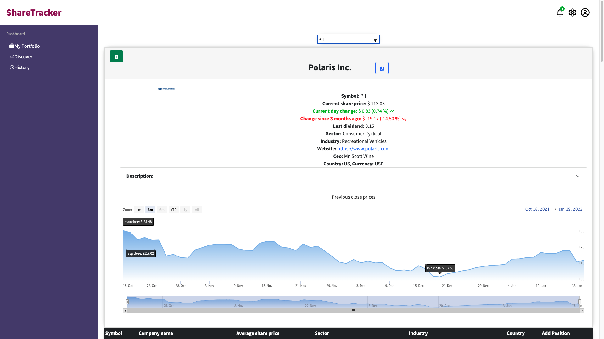
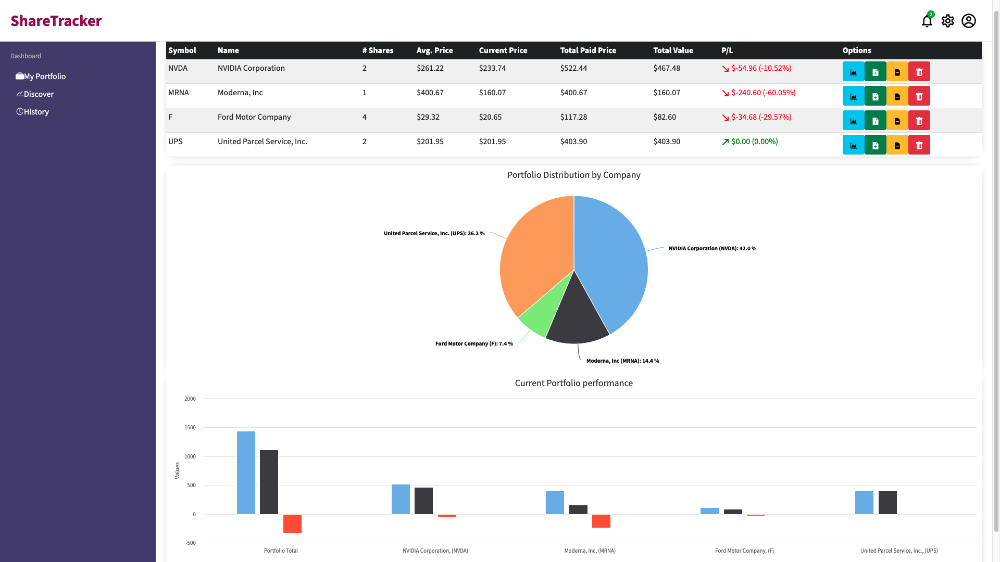

# Share Tracker Application

Portfolio Tracker app allows a user to track their shareholding portfolio performance in real-time.
#

## Project brief

A local trader has come to you with a portfolio of shares. She wants to be able to analyse it more effectively. She has a small sample data set to give you and would like you to build a Minimum Viable Product (MVP) that uses the data to display her portfolio so that she can make better decisions.


## MVP

A user should be able to:

- view total current value.
- view individual and total performance trends.
- retrieve a list of share prices from an external API and add shares to their portfolio.
- View a chart of the current values in their portfolio.

## Extensions

- View current share price of individual shareholdings.
- View average and total paid prices for individual shares in the portfolio.
- View a chart of total paid price, total value and profit/loss.
- Implement a search box to find a specific stock using external API data.
- Compare past share performance data for any publicly traded company.

## Screenshots

Discover area:



Portfolio area:



## API, Libraries, Resources

- https://financialmodelingprep.com/
- https://www.highcharts.com/
- https://reactjs.org/
- https://expressjs.com/
- https://nodejs.org/en/
- https://www.mongodb.com/


#
## Project set up

| Front-end (client) | Back-end (server)    |
| :---               | :---                 |
| `npm install`      | `npm install`        |
| `npm start`        | `npm run seeds`      |
|                    | `npm run server:dev` |

** If cloning to run locally, you will need to sign-up to financial modelling prep and then create  a file in the project within  
``` client/src/services ``` called ```apikey.js```

then copy the below lines into the file, adding your api key where indicated:

```
export const apikey = '<insert api key>'
export const apikeyPH = '<insert api key>' 
```

